# Project Specification: Dashboard de Gobernanza de Datos

## 1. Contexto y Objetivo

[cite_start]El objetivo es construir una aplicación web para la gestión y evaluación de la situación actual, inventario de activos de datos y un glosario corporativo[cite: 4, 14, 20]. [cite_start]La interfaz estará basada casi en su totalidad en visualización y gestión de datos mediante tablas[cite: 24].

## 2. Stack Tecnológico y Arquitectura

- [cite_start]**Backend (Lógica centralizada en su propia carpeta):** NestJS (última versión compatible estrictamente con Node.js 22.17.1)[cite: 38].
- [cite_start]**Frontend:** Angular (última versión compatible estrictamente con Node.js 22.17.0)[cite: 40].
- [cite_start]**Estilos y UI:** TailwindCSS complementado con la librería de componentes DaisyUI[cite: 40].
- [cite_start]**Diseño de API:** Crear una API RESTful[cite: 39]. [cite_start]Se debe diseñar como mínimo un endpoint por cada página/tabla para manejar de forma independiente las acciones CRUD de cada vista[cite: 39].

## 3. Estructura de Navegación e Interfaz (UI/UX)

[cite_start]La aplicación debe contar con un menú de pestañas principal con una jerarquía de 3 niveles de profundidad, donde cada subpágina está embebida en su vista superior[cite: 2, 3].

A continuación se detalla la estructura y las referencias visuales de las tablas a construir:

### [cite_start]Pestaña 1: Qüestionari d'avaluació de la situació actual [cite: 4]

- [cite_start]**Mapa Responsables** [cite: 5]
  - [cite_start]_Rols clau:_ 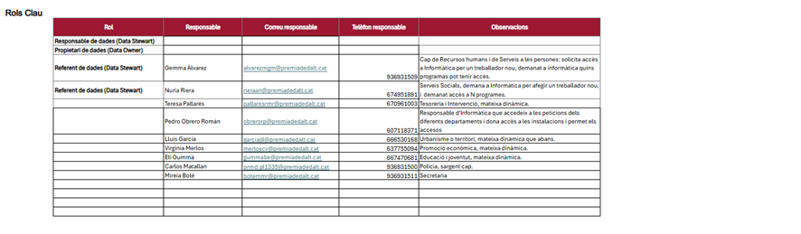 [cite: 6, 25]
  - [cite_start]_Àrees / Dominis:_ 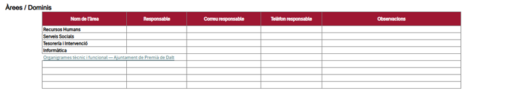 [cite: 7, 26]
  - [cite_start]_Processos clau:_ 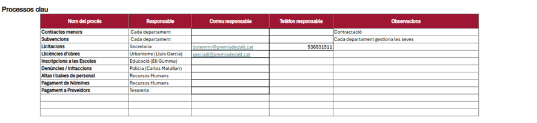 [cite: 8, 27]
  - [cite_start]_Projectes estratègics (p.ej. PAM, Dades Obertes, etc.):_ 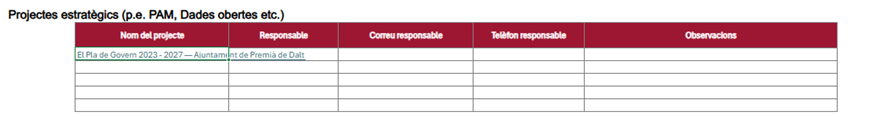 [cite: 9, 28]
  - [cite_start]_Altres responsables:_ 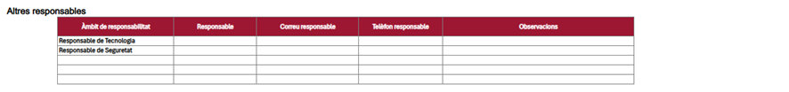 [cite: 10, 29]
- [cite_start]**Sistemas** [cite: 11]
  - [cite_start]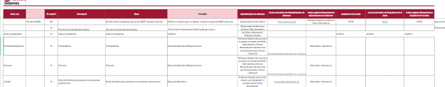 [cite: 30]
- [cite_start]**Qüestionari** [cite: 12]
  - [cite_start]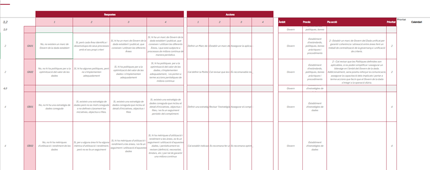 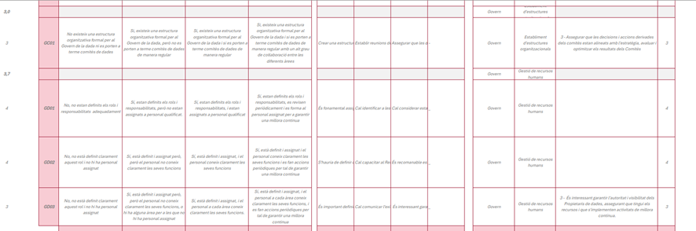 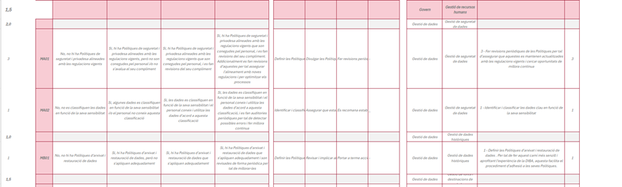 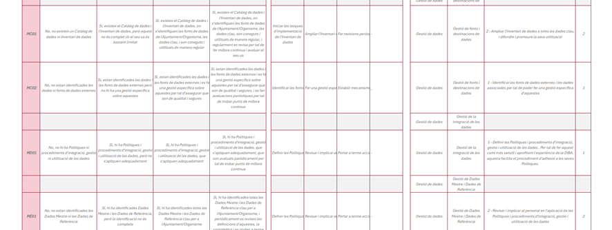 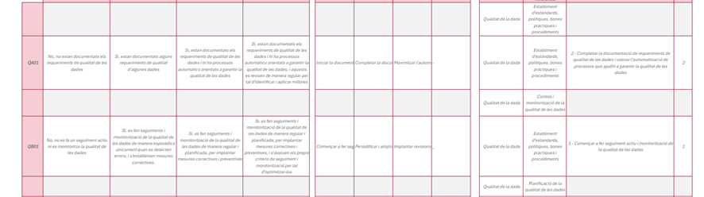 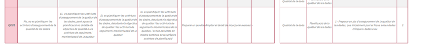 [cite: 31]
- [cite_start]**Resultat** [cite: 13]
  - [cite_start]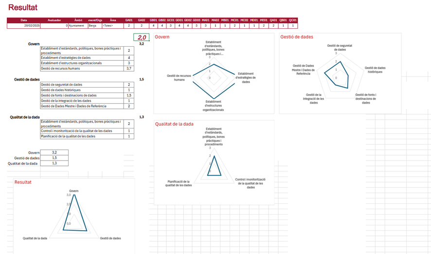 [cite: 32]

### [cite_start]Pestaña 2: Plantilla d’inventari d’actius de dades [cite: 14]

- [cite_start]**Entitats** [cite: 15]
  - [cite_start]_Nota: Unir estas tablas de forma horizontal en la UI:_ 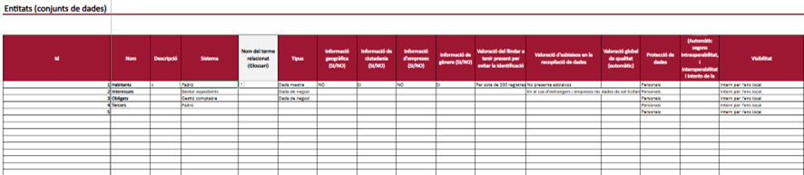 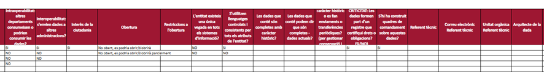 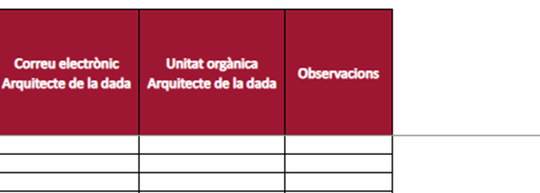 [cite: 33, 34]
- [cite_start]**Atributs** [cite: 16]
- **Rel. [cite_start]Atributs** [cite: 17]
  - [cite_start]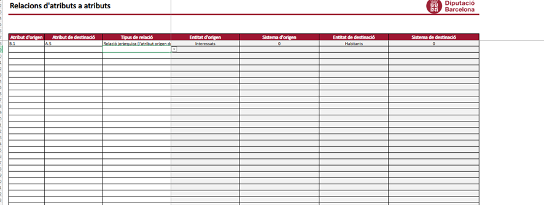 [cite: 35]
- [cite_start]**Llistes** [cite: 18]
- [cite_start]**Llegenda** [cite: 19]

### [cite_start]Pestaña 3: Plantilla de glossari [cite: 20]

- [cite_start]**Glossari** [cite: 21]
  - [cite_start]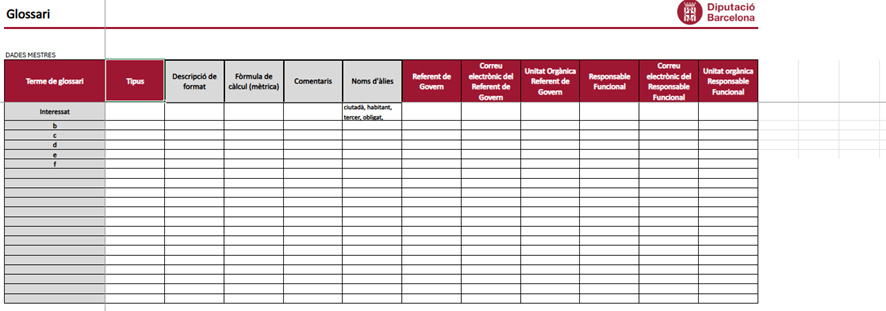 [cite: 36]
- **Rel. [cite_start]Glossari** [cite: 22]
  - [cite_start]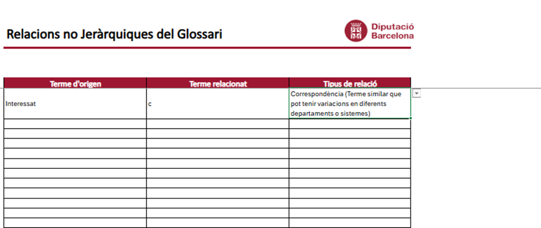 [cite: 37]
- [cite_start]**Llegenda** [cite: 23]

## 4. Fases de Ejecución del Agente

Agente, ejecuta este proyecto paso a paso, verificando cada fase antes de pasar a la siguiente:

1.  **Fase 1 (Setup):** Inicializa el monorepo o las carpetas separadas para Backend (NestJS) y Frontend (Angular). Configura Tailwind y DaisyUI.
2.  **Fase 2 (Core UI):** Crea la estructura base de enrutamiento en Angular para soportar los 3 niveles de navegación especificados.
3.  **Fase 3 (Backend & Modelado):** Genera los esquemas de datos, controladores y servicios CRUD en NestJS para cada una de las tablas.
4.  **Fase 4 (Integración):** Desarrolla los componentes de tabla en Angular basándote en las imágenes de referencia y conéctalos con la API REST.
